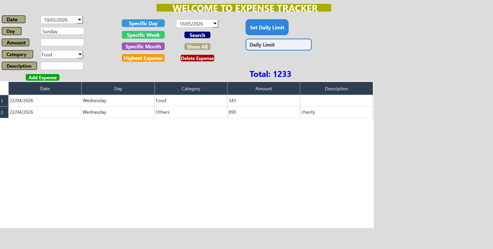

# 💰 Expense Tracker App

This is a professional desktop application developed using **C++** and **Qt Framework**.

## 🖼️ App Interface
Here is how the application looks and works:

---

## 🚀 How to Run the Application
You can try the app without installing any coding software.

1. **Download** the `Expense Tracker.zip` file from the list above.
2. **Extract** the contents of the zip folder.
3. Double-click on the **.exe** file to run the app.

## ⭐ Support the Project
If you like this app and find it helpful, please consider giving this repository a **Star**! It helps others discover my work.

*Developed by Y-Alam-Official*
